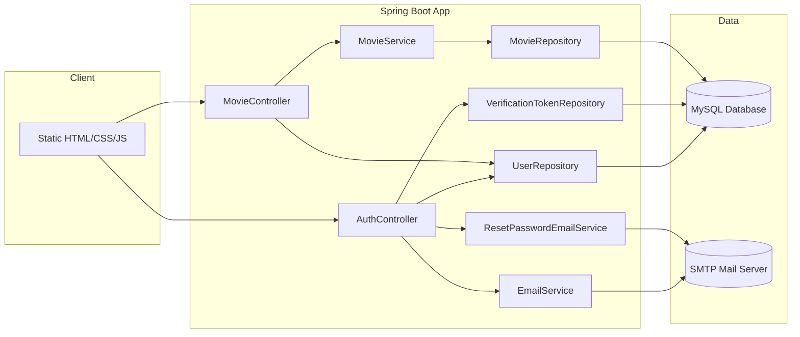
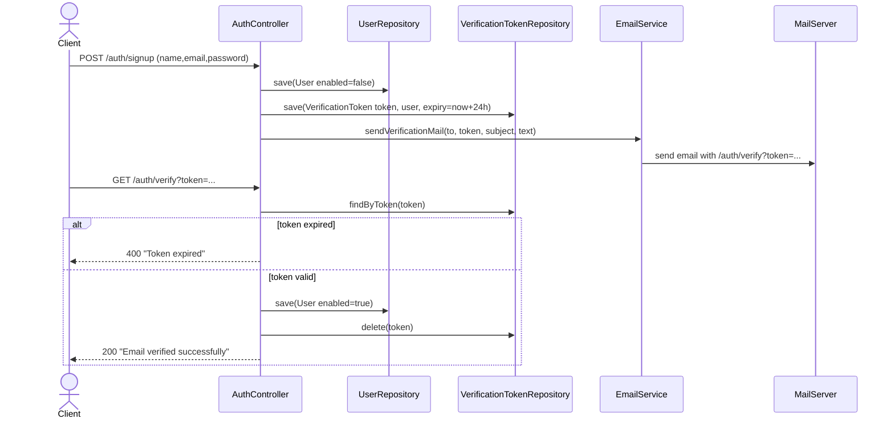
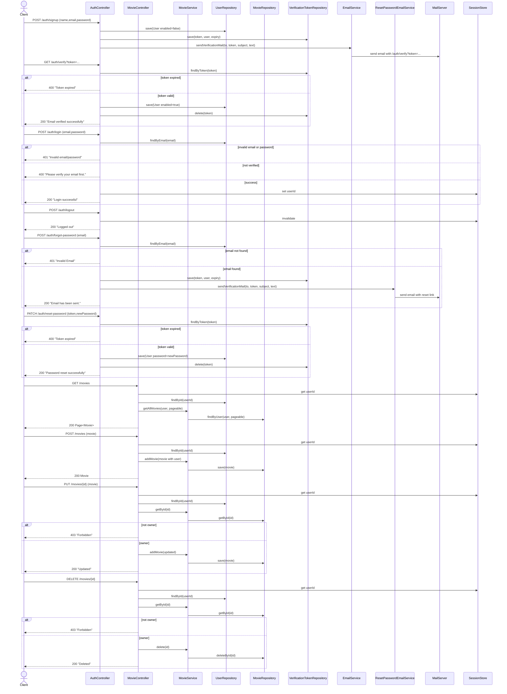

# 🎬 CineLog — Movie Tracker App

CineLog is a full-stack movie tracking web application that allows users to manage their personal movie list — add, update, delete, and track watching status.

---

## 🏛️ Overall Architecture

## 🧭 Sequence Diagram: Sign Up + Email Verification

## 🧩 Sequence Diagram: All Features

## 🚀 Features

- 🔐 Session-based authentication  
- 🎥 Add, edit, delete movies  
- 📄 Pagination support  
- 🔍 Search & filter (by status and genre)  
- 📊 Dashboard stats (Total, Watching, Watched)  
- 🛡️ User-based authorization (ownership checks)  
- 🎨 Modern responsive UI  
- 📧 Email verification for registration
- 🕒 Forget password functionality with email reset link

---

## 🏗️ Tech Stack

### Backend
- Java Spring Boot  
- Spring Data JPA  
- Hibernate  
- MySQL (configurable)  
- HttpSession (for authentication)  
- JavaMailSender (for email verification)

### Frontend
- HTML5  
- CSS3 (custom styling)  
- Vanilla JavaScript  

---
